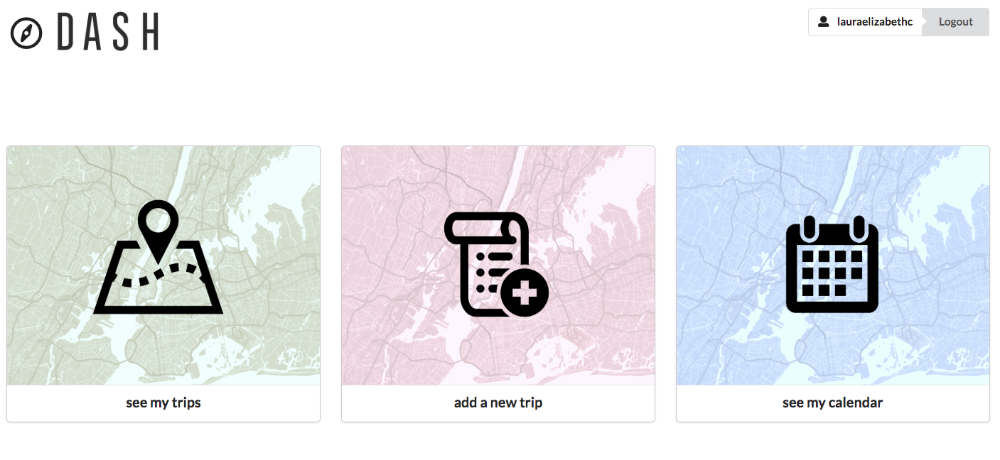
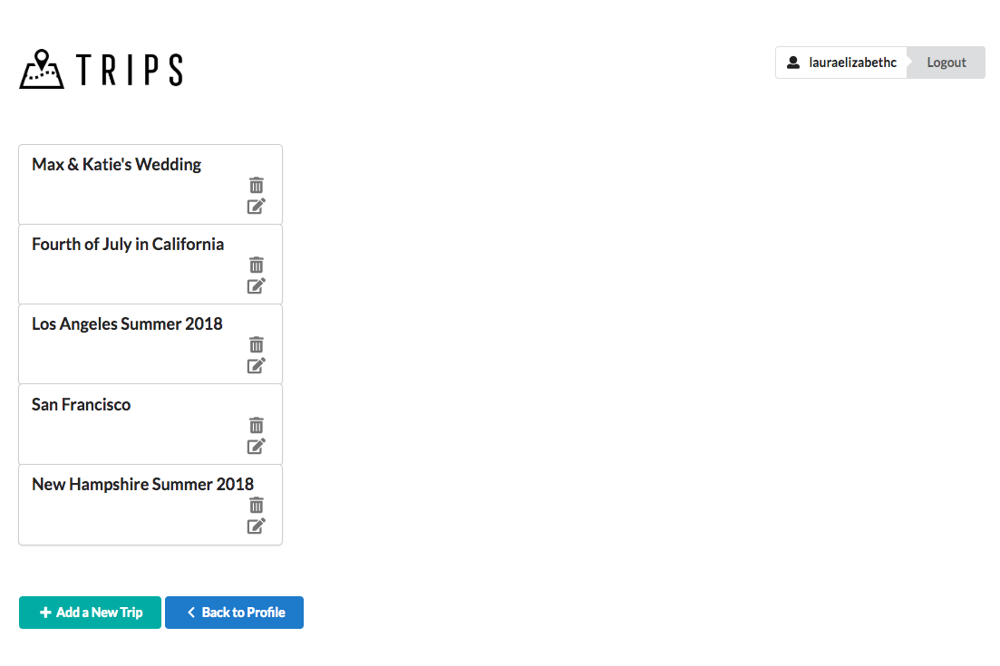
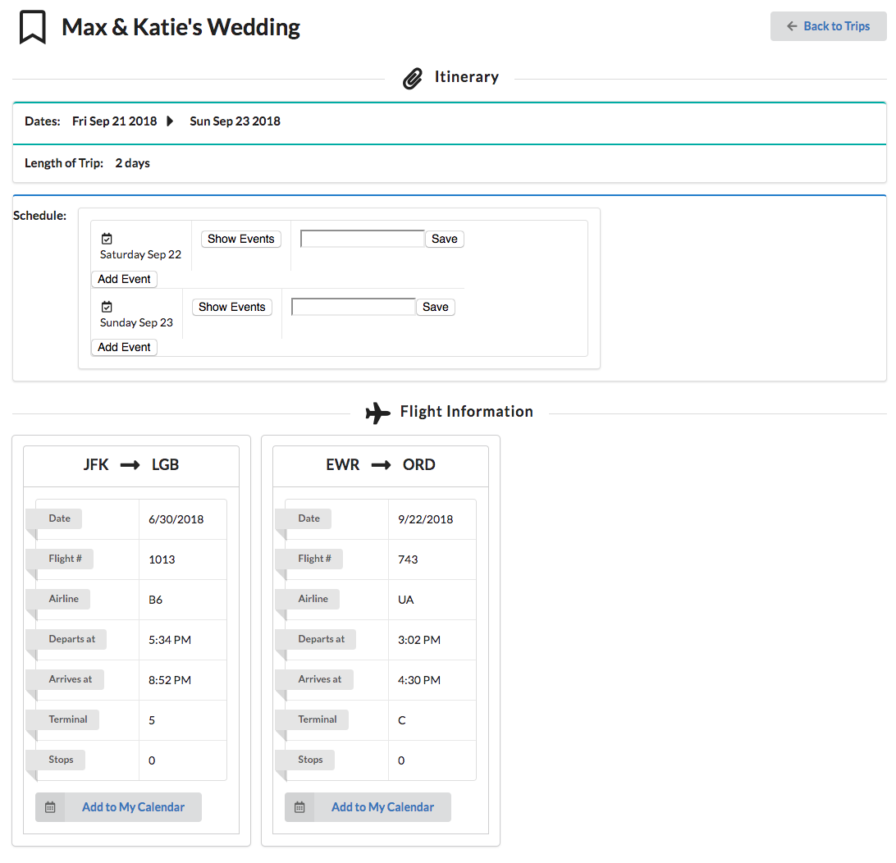

## Dash (Front End)
A travel dashboard to organize your entire itinerary in one easily-accessible, portable place. Keep track of everything involved in a trip - flights, itinerary, packing list, and resources.

## Motivation
This is a student project, created in my final module for Flatiron School's immersive web development program.
 
## Screenshots






## Tech/framework used

<b>Built with</b>
- [React](https://reactjs.org/)
- [Redux](https://redux.js.org/)

## Installation

First make sure the backend is running (located at https://github.com/laura-campbell/dash), then:

```$ yarn install```

```$ yarn start```

## API Reference

FlightStats API (https://developer.flightstats.com/api-docs/)
